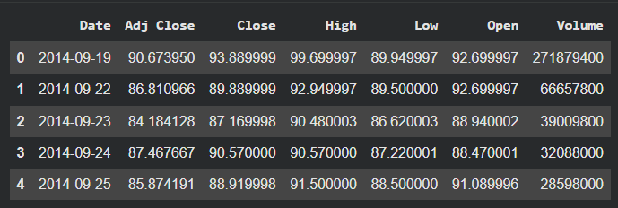
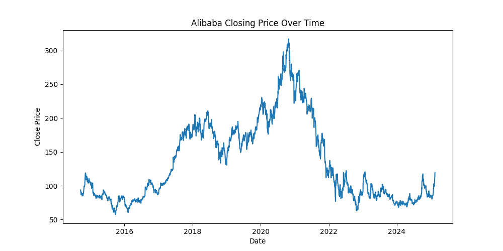
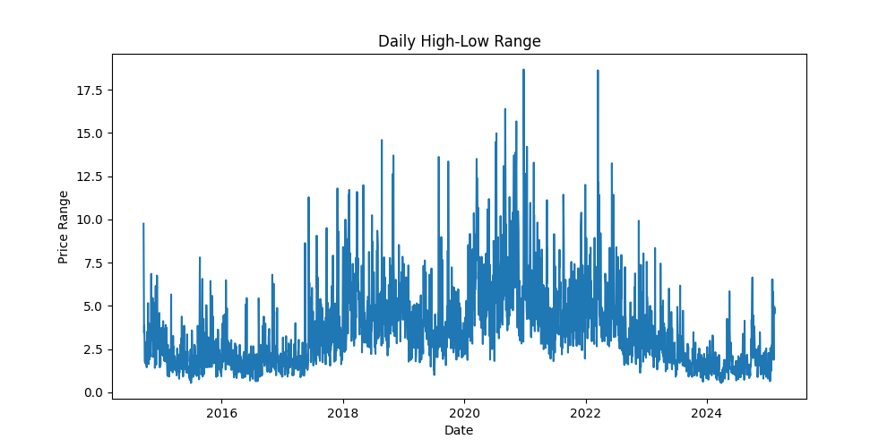
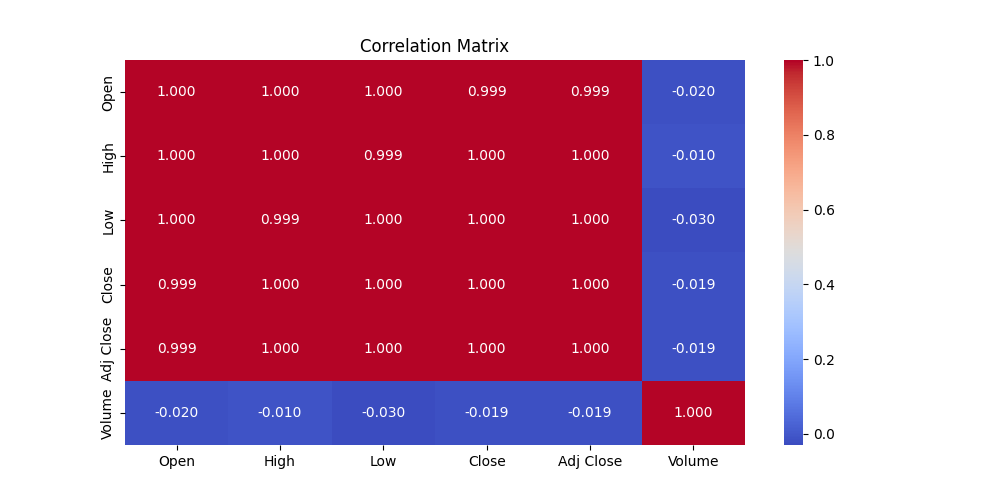

# Alibaba-Stock-Prices-Analysis
Alibaba Group Holding Ltd. merupakan perusahaan teknologi terbesar dari Tiongkok yang memainkan peran penting dalam perkembangan ekonomi digital, baik di pasar domestik Tiongkok maupun secara global. Saham Alibaba diperdagangkan di beberapa bursa International salah satunya di New York Stock Exchange dengan kode BABA.

Harga saham Alibaba seringkali mengalami fluktuasi yang cukup tinggi karena dipengaruhi oleh faktor internal perusahaan maupun faktor eksternal seperti perubahan regulasi, kondisi pasar global dan kompetisi antar investor. Oleh karena itu, diperlukan analisis harga saham Alibaba untuk memahami pola pergerakan harga, mengidentifikasi tren, serta mengevaluasi potensi risiko dan peluang investasi.

## Dataset
Data berupa saham Alibaba periode Januari 2014 hingga Februari 2025 yang diambil dari New York Stock Exchange(NYSE). Dataset ini bersumber dari [Kaggle](https://www.kaggle.com/datasets/mhassansaboor/alibaba-stock-dataset-2025/data)\

## Exploratory Data Analysis
### Tren Harga Penutupan (Close Price)
\
Dari tren harga closing, bisa dilihat bahwa harga penutupan mengalami fluktuasi yang cukup signifikan dari waktu ke waktu. Terdapat beberapa periode di mana harga meningkat tajam hingga mencapai
level tinggi, namun kenaikan tersebut tidak terjadi secara konsisten
sepanjang waktu. Harga terendah sekitar tahun 2015 dan mencapai puncak sekitar tahun 2020.

### Daily High-Low Range
\
Grafik rentang harga harian (High–Low) menunjukkan bahwa volatilitas
harga saham Alibaba bervariasi dari waktu ke waktu. Terdapat beberapa
periode dengan rentang harga yang jauh lebih besar dibandingkan periode
lainnya, yang mengindikasikan adanya peningkatan volatilitas harian. Lonjakan pada rentang High–Low pada periode tertentu menunjukkan bahwa
pada hari-hari tersebut terjadi pergerakan harga yang lebih ekstrem,
meskipun arah pergerakan tidak selalu sama.

### Trend Volume
\
Grafik volume perdagangan menunjukkan bahwa aktivitas transaksi saham
Alibaba bervariasi dari waktu ke waktu, dengan beberapa periode
menunjukkan lonjakan volume yang signifikan. Lonjakan tersebut
mengindikasikan meningkatnya partisipasi pelaku pasar pada periode
tertentu.\
Peningkatan volume pada periode tertentu sejalan dengan meningkatnya
volatilitas harga, yang menunjukkan bahwa pergerakan harga pada periode
tersebut didukung oleh aktivitas perdagangan yang tinggi.
\
Grafik tren volume per tahun menunjukkan bahwa pada tahun 2014 terjadi perdagangan yang sangat aktif yang mencerminkan sentimen pasar yang sangat kuat. Sebaliknya volume perdagangan terendah terjadi pada tahun 2016 yang menunjukkan pada tahun tersebut pasar lebih sepi atau kurangnya sentimen pasar terhadap saham.

### Moving Average
\
Grafik moving average menunjukkan bahwa harga saham Alibaba mengalami
tren kenaikan yang kuat sejak sekitar tahun 2015 hingga mencapai puncak pada tahun 2020-2021, ditandai dengan MA 20 yang sering berada di atas MA 100 hari, menunjukkan kondisi bullish. Setelah
mencapai puncaknya, harga mengalami penurunan signifikan, ditandai oleh
perpotongan MA 20 dan MA 100 dan posisi MA 20 yang berada di bawah MA 100, mengindikasikan perubahan tren menjadi bearish.
Pada periode selanjutnya, pergerakan harga cenderung lebih stabil
dengan moving average yang relatif mendatar.

### Correlation Matrix
\
Hasil analisis korelasi menunjukkan bahwa variabel Open, High, Low,
dan Close memiliki korelasi yang sangat kuat satu sama lain, yang
menunjukkan bahwa pergerakan harga saham bersifat konsisten dalam satu
hari perdagangan. Sementara itu, volume perdagangan memiliki korelasi
yang relatif lemah terhadap harga, yang mengindikasikan bahwa tingginya
volume tidak selalu diikuti oleh perubahan harga yang signifikan.

## Kesimpulan
Dari hasil EDA, dapat disimpulkan bahwa saham Alibaba memiliki karakteristik fluktuatif. Harga penutupan mengalami kenaikan yang signifikan sejak sekitar tahun 2015 hingga mencapai puncaknya pada periode 2020–2021, sebelum akhirnya mengalami penurunan yang cukup tajam. Volatilitas harga tidak konstan, dengan beberapa periode menunjukkan pergerakan harga harian yang ekstrem. Volume perdagangan juga bervariasi dan cenderung meningkat pada periode volatilitas tinggi, meskipun korelasinya terhadap harga relatif lemah. Analisis moving average mengindikasikan adanya perubahan tren dari bullish ke bearish, diikuti oleh fase konsolidasi pada periode terakhir. Secara keseluruhan, saham Alibaba menunjukkan dinamika pasar yang kuat dengan perubahan tren yang jelas dari waktu ke waktu.

