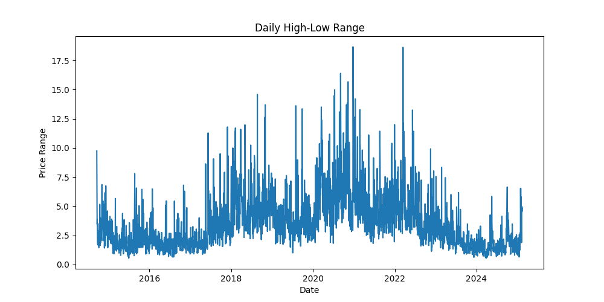
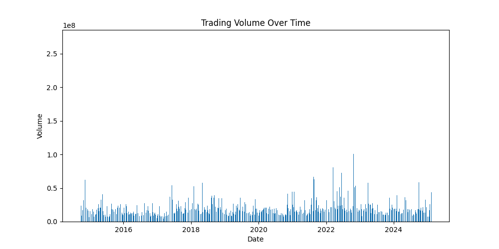
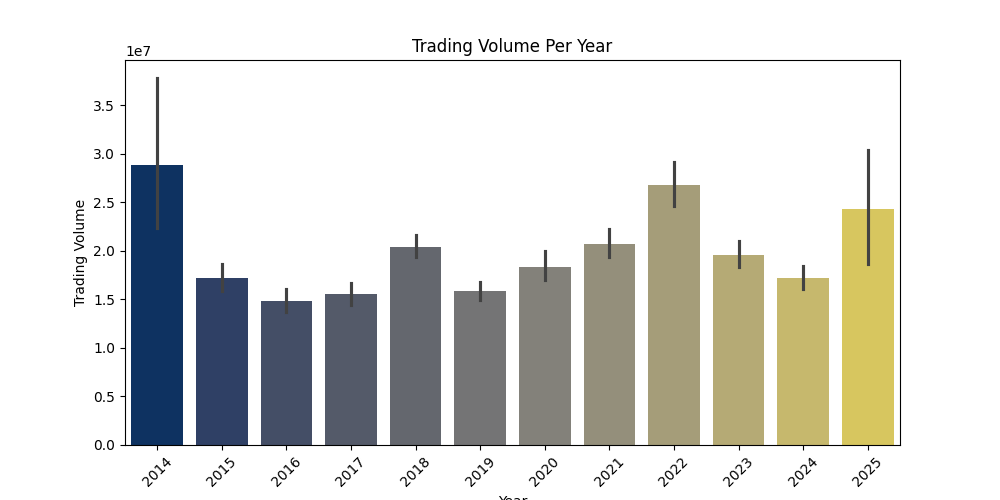
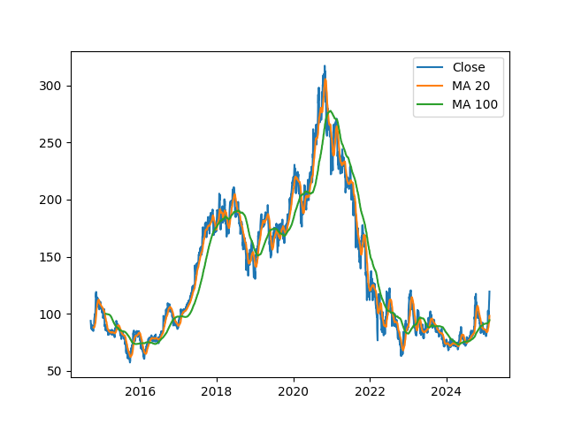
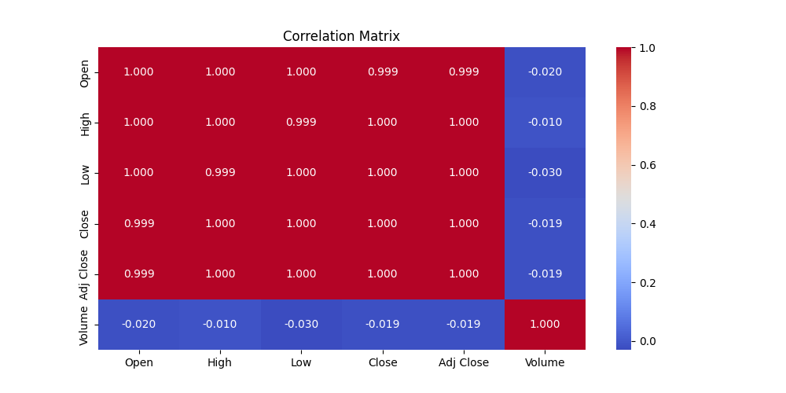

# Alibaba-Stock-Prices-Analysis
Alibaba Group Holding Ltd. merupakan salah satu perusahaan teknologi terbesar di Tiongkok yang memainkan peran penting dalam perkembangan ekonomi digital, baik di pasar domestik maupun secara global. Saham Alibaba diperdagangkan di beberapa bursa International salah satunya di New York Stock Exchange (NYSE) dengan kode BABA.

## Project Overview
Project ini bertujuan untuk menganalisis pergerakan harga saham Alibaba menggunakan pendekatan data analytics guna mengidentifikasi pola, tren, volatilitas, serta potensi risiko dan peluang investasi. Hasil analisis diharapkan dapat memberikan insight yang bermanfaat sebagai pendukung pengambilan keputusan bagi investor maupun pihak yang tertarik mempelajari perilaku pasar saham.

## Business Problem
Saham merupakan aset penting bagi perusahaan sebagai sumber pendanaan untuk mendukung ekspansi bisnis, sekaligus menjadi instrumen investasi bagi investor. Saham memiliki pergerakan harga yang dinamis dan dipengaruhi oleh berbagai faktor, seperti kinerja perusahaan, kondisi ekonomi, perubahan regulasi, serta sentimen pasar. Oleh karena itu, analisis pasar saham penting dilakukan untuk memahami pola pergerakan pasar dan mendukung pengambilan keputusan investasi yang lebih baik. Sebagai salah satu perusahaan teknologi terbesar di dunia, harga saham Alibaba (BABA) mengalami fluktuasi yang cukup tinggi dari waktu ke waktu. Analisis terhadap data historis harga saham diperlukan untuk mengidentifikasi tren, mengukur tingkat volatilitas, serta menemukan insight mengenai potensi risiko dan peluang investasi.

## Dataset Description
Data berupa saham Alibaba periode Januari 2014 hingga Februari 2025 yang diambil dari New York Stock Exchange(NYSE). Dataset ini bersumber dari [Kaggle].
(https://www.kaggle.com/datasets/mhassansaboor/alibaba-stock-dataset-2025/data)\

Data tersebut berisi informasi mengenai pergerakan saham Alibaba Group yang terdaftar di NYSE yang terdiri dari beberapa variabel yang merepresentasikan aktivitas perdagangan saham, sebagai berikut,
- Date: Menunjukkan tanggal perdagangan saham.
- Adj Close: Harga penutupan yang telah disesuaikan setelah pembagian dividen dan stock split.
- Close: Harga saham pada saat penutupan pasar.
- High: Harga tertinggi yang dicapai saham dalam satu hari perdagangan.
- Low: Harga terendah yang dicapai saham dalam satu hari perdagangan.
- Open: Harga saham pada saat pembukaan pasar.
- Volume: Jumlah saham yang diperdagangkan dalam satu hari.

## Dashboard Overview

## Dashboard Insights & Business Recommendation 
### Key Performance Indicator

- rbwrjee

### Daily High-Low Range
\
Grafik rentang harga harian (High–Low) menunjukkan bahwa volatilitas
harga saham Alibaba bervariasi dari waktu ke waktu. Terdapat beberapa
periode dengan rentang harga yang jauh lebih besar dibandingkan periode
lainnya, yang mengindikasikan adanya peningkatan volatilitas harian. Lonjakan pada rentang High–Low pada periode tertentu menunjukkan bahwa
pada hari-hari tersebut terjadi pergerakan harga yang lebih ekstrem,
meskipun arah pergerakan tidak selalu sama.

### Trend Volume
\
Grafik volume perdagangan menunjukkan bahwa aktivitas transaksi saham
Alibaba bervariasi dari waktu ke waktu, dengan beberapa periode
menunjukkan lonjakan volume yang signifikan. Lonjakan tersebut
mengindikasikan meningkatnya partisipasi pelaku pasar pada periode
tertentu.\
Peningkatan volume pada periode tertentu sejalan dengan meningkatnya
volatilitas harga, yang menunjukkan bahwa pergerakan harga pada periode
tersebut didukung oleh aktivitas perdagangan yang tinggi.
\
Grafik tren volume per tahun menunjukkan bahwa pada tahun 2014 terjadi perdagangan yang sangat aktif yang mencerminkan sentimen pasar yang sangat kuat. Sebaliknya volume perdagangan terendah terjadi pada tahun 2016 yang menunjukkan pada tahun tersebut pasar lebih sepi atau kurangnya sentimen pasar terhadap saham.

### Moving Average
\
Grafik moving average menunjukkan bahwa harga saham Alibaba mengalami
tren kenaikan yang kuat sejak sekitar tahun 2015 hingga mencapai puncak pada tahun 2020-2021, ditandai dengan MA 20 yang sering berada di atas MA 100 hari, menunjukkan kondisi bullish. Setelah
mencapai puncaknya, harga mengalami penurunan signifikan, ditandai oleh
perpotongan MA 20 dan MA 100 dan posisi MA 20 yang berada di bawah MA 100, mengindikasikan perubahan tren menjadi bearish.
Pada periode selanjutnya, pergerakan harga cenderung lebih stabil
dengan moving average yang relatif mendatar.

### Correlation Matrix
\
Hasil analisis korelasi menunjukkan bahwa variabel Open, High, Low,
dan Close memiliki korelasi yang sangat kuat satu sama lain, yang
menunjukkan bahwa pergerakan harga saham bersifat konsisten dalam satu
hari perdagangan. Sementara itu, volume perdagangan memiliki korelasi
yang relatif lemah terhadap harga, yang mengindikasikan bahwa tingginya
volume tidak selalu diikuti oleh perubahan harga yang signifikan.

## Kesimpulan
Dari hasil EDA, dapat disimpulkan bahwa saham Alibaba memiliki karakteristik fluktuatif. Harga penutupan mengalami kenaikan yang signifikan sejak sekitar tahun 2015 hingga mencapai puncaknya pada periode 2020–2021, sebelum akhirnya mengalami penurunan yang cukup tajam. Volatilitas harga tidak konstan, dengan beberapa periode menunjukkan pergerakan harga harian yang ekstrem. Volume perdagangan juga bervariasi dan cenderung meningkat pada periode volatilitas tinggi, meskipun korelasinya terhadap harga relatif lemah. Analisis moving average mengindikasikan adanya perubahan tren dari bullish ke bearish, diikuti oleh fase konsolidasi pada periode terakhir. Secara keseluruhan, saham Alibaba menunjukkan dinamika pasar yang kuat dengan perubahan tren yang jelas dari waktu ke waktu.

