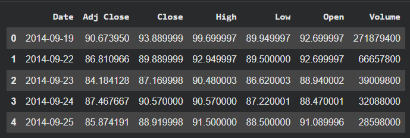
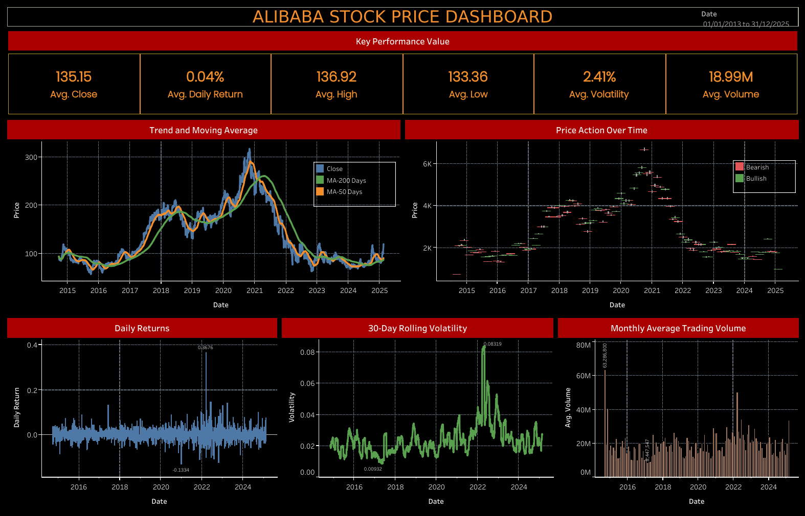
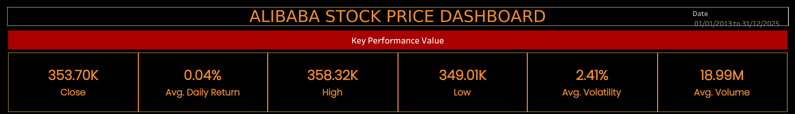
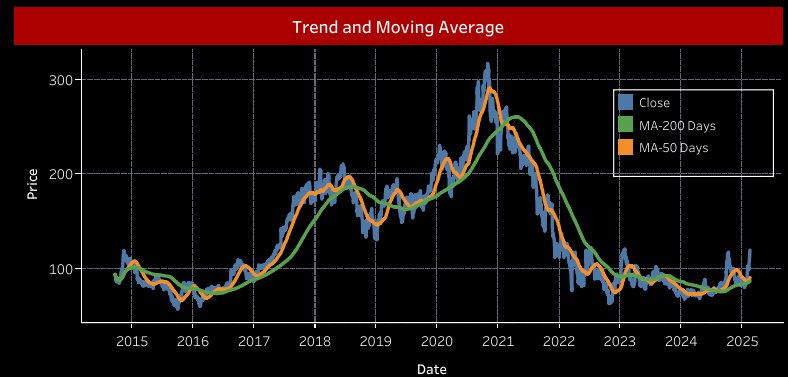
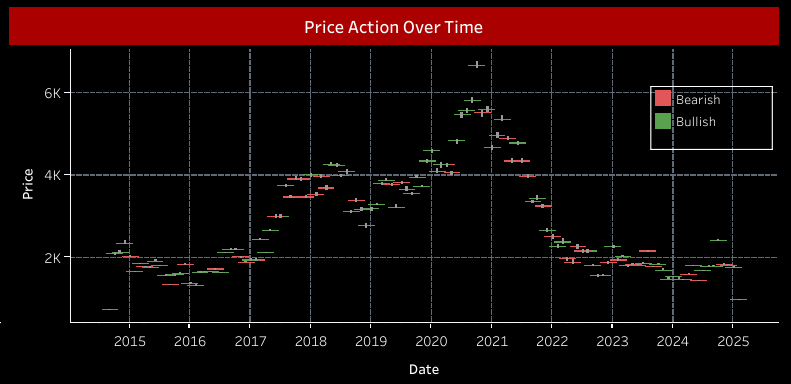
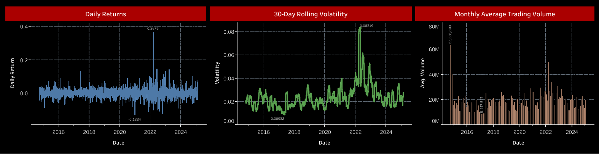

# Alibaba-Stock-Prices-Analysis
Alibaba Group Holding Ltd. is one of the largest technology companies in China, playing a significant role in the development of the digital economy, both in the domestic market and globally. Alibaba's stock is traded on several international stock exchanges, one of which is the New York Stock Exchange (NYSE) under the ticker symbol BABA.

## Project Overview
This project aims to analyze Alibaba's stock price movements using a data analytics approach to identify patterns, trends, volatility, as well as potential investment risks and opportunities. The analysis results are expected to provide valuable insights to support decision-making for investors and those interested in studying stock market behavior.

## Business Problem
Stocks are important assets for companies as a source of funding to support business expansion, while also serving as an investment instrument for investors. Stock prices are dynamic and influenced by various factors, such as company performance, economic conditions, regulatory changes, and market sentiment. Therefore, stock market analysis is essential to understand market movement patterns and support better investment decision-making. As one of the world's largest technology companies, Alibaba's (BABA) stock experiences significant fluctuations over time. Analyzing historical stock price data is necessary to identify trends, measure volatility, and gain insights into potential investment risks and opportunities.

## Dataset Description
The data consists of Alibaba stock from January 2014 to February 2025, obtained from the New York Stock Exchange (NYSE). This dataset is sourced from [Kaggle].
(https://www.kaggle.com/datasets/mhassansaboor/alibaba-stock-dataset-2025/data)\

The data contains information on the trading activities of Alibaba Group shares listed on the NYSE. It includes the following variables:
- Date: The stock trading date.
- Adj Close: The adjusted closing price after accounting for dividends and stock splits.
- Close: The stock's closing price at the end of the trading day.
- High: The highest price reached during the trading day.
- Low: The lowest price reached during the trading day.
- Open: The stock's opening price at the beginning of the trading day.
- Volume: The number of shares traded during the trading day.

## Dashboard Overview

## Insights & Business Recommendation 
### Key Performance Indicator

- The average closing price was 135.15, with an average daily high of 136.92 and an average daily low of 133.36, indicating a relatively narrow daily trading range.
  - _Investors may consider applying a range trading strategy or waiting for a confirmed breakout before entering new positions, as limited price movements generally offer fewer profit opportunities until a clearer market trend emerges._
- The average daily return of 0.04% indicates relatively slow daily growth, suggesting a period of price stagnation.
  - _Investors should not rely solely on short-term capital gains but should combine technical and fundamental analysis to generate more reliable investment signals and reduce the risk of making uninformed decisions._
- The average daily trading volume of 18.99 million shares reflects strong market activity and high liquidity.
  - _High liquidity enables investors to enter and exit positions more efficiently, typically with lower slippage risk and narrower bid-ask spreads, resulting in smoother trade execution._

### Trend and Moving Average

- Alibaba's stock price experienced a strong upward trend from 2016 to 2020, reflecting the company's growth phase and increasing investor confidence. However, during 2021–2022, a significant trend reversal occurred, marked by the 50-day Moving Average crossing below the 200-day Moving Average (Death Cross), indicating strong bearish momentum.
  - _Investors should increase caution during bearish periods and implement risk management strategies, such as using stop-loss orders or reducing portfolio exposure to limit potential losses_.
- Since 2023, the stock price has moved sideways, indicating a consolidation phase following a downtrend. Although recent price movements suggest early signs of recovery, the momentum remains insufficient to confirm the formation of a long-term bullish trend.
  - _Investors should wait for confirmation of a breakout or stronger bullish signal before adding to their positions to minimize the risk of a false breakout._

### Candlestick

- Bullish and bearish candlesticks alternated throughout 2017–2021, but bullish candlesticks remained dominant, reflecting stronger buying pressure that drove the stock price to its peak in 2021. This was followed by an increase in bearish candlesticks and a sharp price decline, indicating a shift in market sentiment from bullish to bearish.
  - _Investors should monitor changes in candlestick dominance as an early signal of a trend reversal, allowing them to reduce their exposure or implement risk management strategies before selling pressure intensifies._
- During 2023–2025, bullish and bearish candlesticks became more balanced within a relatively narrow trading range, indicating a consolidation phase and market uncertainty.
  - _Investors are advised to wait for a confirmed breakout supported by higher trading volume or a strong bullish candlestick pattern before opening new positions to reduce the risk of a false breakout._

### Daily Return, Volatility and Volume

- Daily returns fluctuate around zero, indicating the absence of a consistent short-term price direction. Several extreme positive and negative return spikes suggest the impact of major market events, while sharp declines reflect periods of market correction or increased selling pressure (panic selling).
  - _Investors should pay close attention to periods of extreme return fluctuations, as they often signal elevated market risk. Combining technical analysis, fundamental analysis, and sound risk management can help mitigate the impact of heightened volatility._
- Volatility remained relatively low and stable before 2020, reflecting calmer market conditions. It increased significantly during 2021–2022, indicating heightened uncertainty and market risk. Although volatility declined afterward, it remained above pre-2020 levels, suggesting that the market continues to be more sensitive to external factors.
  - _Investors are advised to adjust their position sizing and implement stricter risk management strategies during periods of elevated volatility to limit potential losses._
- Trading volume remained relatively stable throughout the observation period, indicating consistent market participation. A significant surge in trading volume during 2021–2022 reflected increased investor activity driven by major market events. Although trading volume declined afterward, it remained above its earlier levels, suggesting that investor interest in Alibaba stock remains relatively strong.
  - _Investors can use trading volume as a confirmation indicator for price movements, as price increases or declines supported by high trading volume generally provide stronger and more reliable trend signals than those accompanied by low trading volume._

## Conclusion
Overall, Alibaba's stock has gone through a complete market cycle, starting with strong growth during 2016–2020, peaking in 2020–2021, and then experiencing a sharp correction in 2021–2022, marking a shift to a bearish market. Since 2023, the stock has been moving in a consolidation phase with early signs of recovery, although a long-term bullish trend has yet to be confirmed. Therefore, investors are advised to remain cautious, wait for stronger trend confirmation before increasing their positions, and combine technical analysis, fundamental analysis, and sound risk management to make more informed investment decisions.

